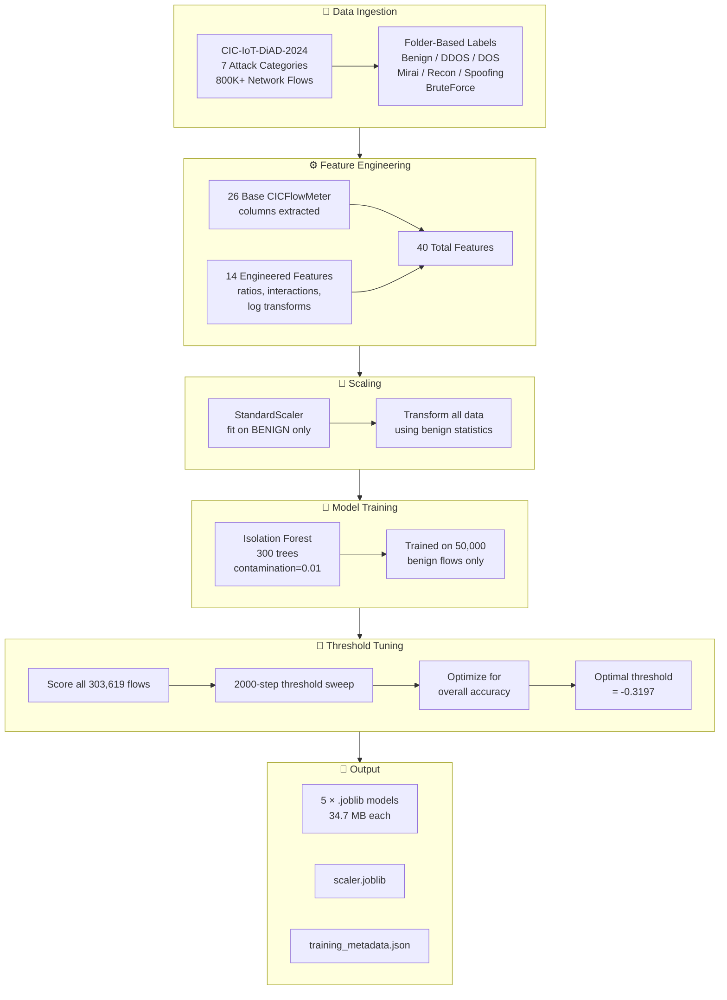
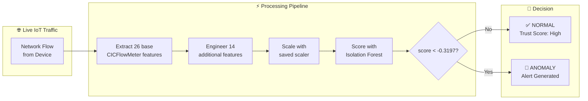
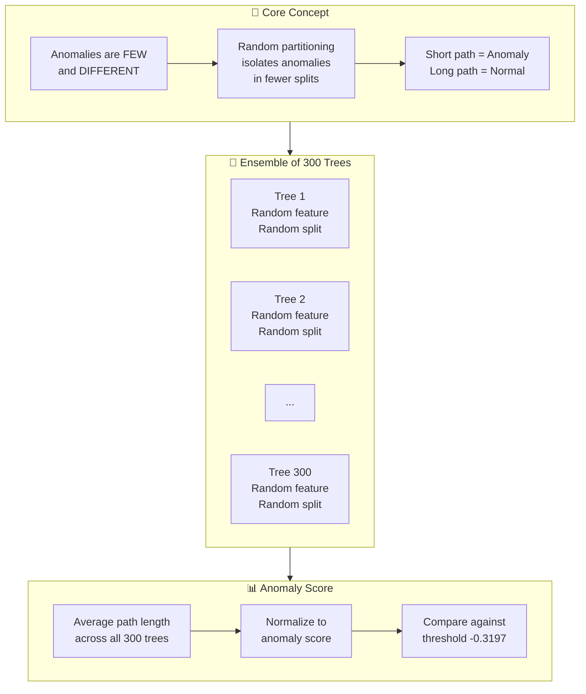
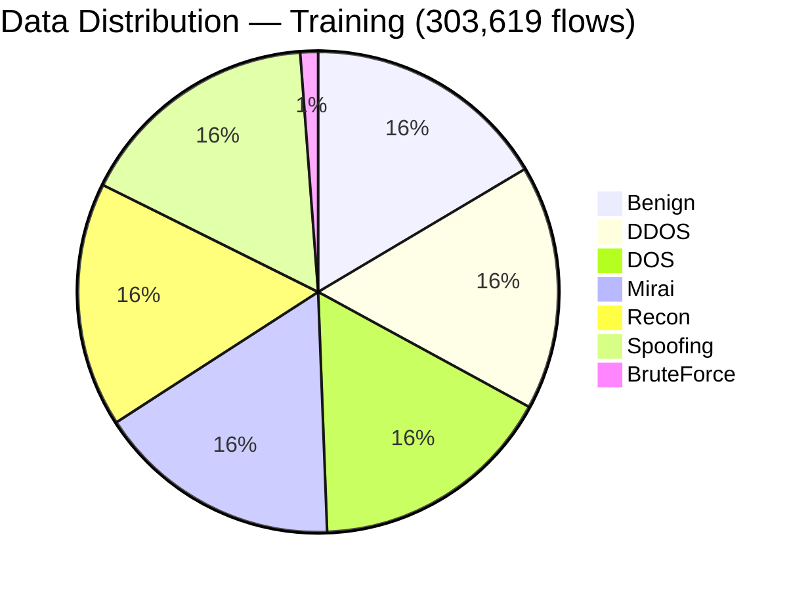
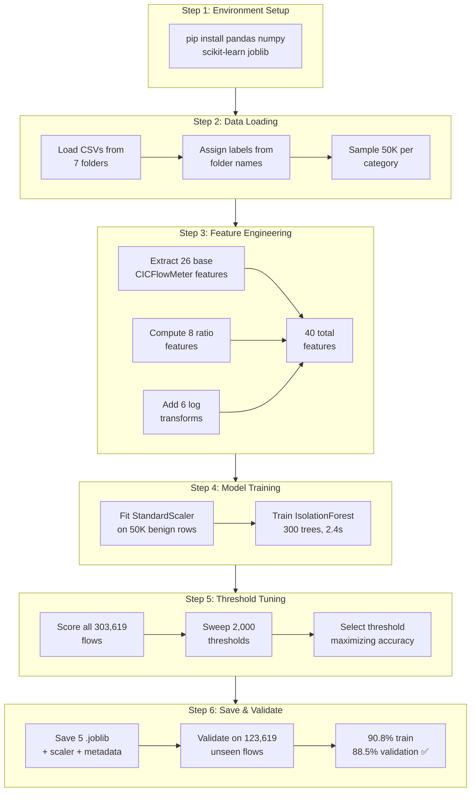
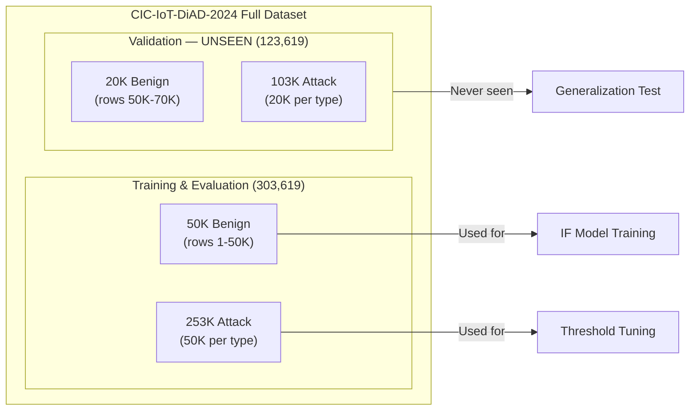
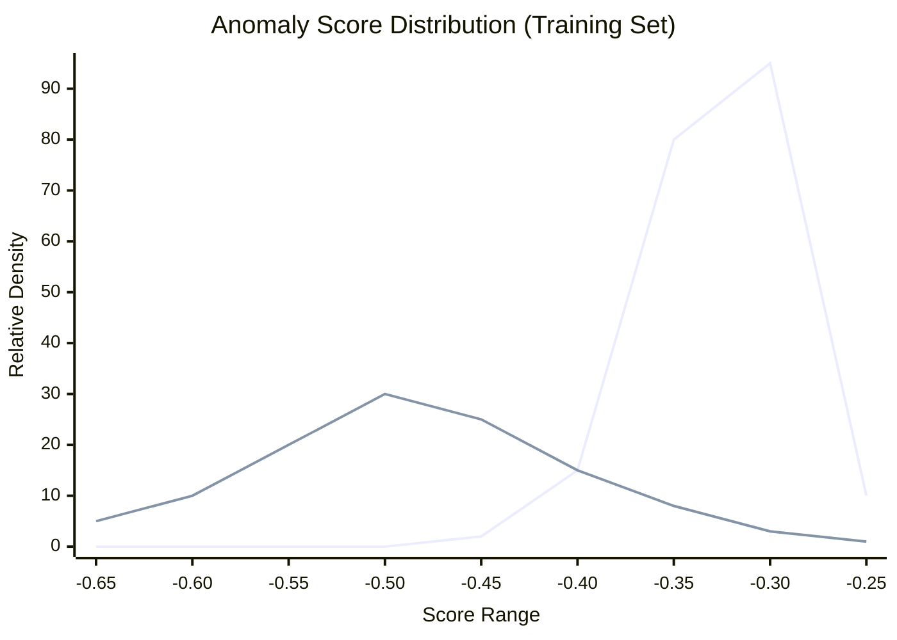

# 🛡️ IoT Sentinel — ML Model Training

> **Behavioral Trust & Drift Intelligence for IoT Networks**
> Hackathon Submission — March 2026

---

## 📊 Model Performance Summary

| Metric | Training Set | Validation (Unseen Data) |
|--------|:-----------:|:------------------------:|
| **Overall Accuracy** | **90.8%** | **88.5%** |
| Attack Precision | 90.4% | 88.0% |
| Attack Recall | 99.6% | 99.9% |
| Attack F1 Score | 94.8% | 93.6% |
| Benign Precision | 95.6% | 98.4% |
| Benign Recall | 46.4% | 29.7% |
| False Positive Rate | 53.6% | 70.3% |
| Macro-Avg F1 | 78.6% | 69.6% |
| Weighted-Avg F1 | 89.5% | 85.8% |

### Per-Attack-Type Detection Rates

| Attack Type | Training Detected | Training Total | Training Rate | Val Detected | Val Total | Val Rate |
|-------------|:-:|:-:|:-:|:-:|:-:|:-:|
| **DDOS** | 50,000 | 50,000 | **100.0%** | 20,000 | 20,000 | **100.0%** |
| **DOS** | 49,999 | 50,000 | **100.0%** | 19,999 | 20,000 | **100.0%** |
| **BruteForce** | 3,619 | 3,619 | **100.0%** | 3,619 | 3,619 | **100.0%** |
| **Mirai** | 49,906 | 50,000 | **99.8%** | 19,987 | 20,000 | **99.9%** |
| **Spoofing** | 49,949 | 50,000 | **99.9%** | 19,940 | 20,000 | **99.7%** |
| **Recon** | 49,069 | 50,000 | **98.1%** | 19,976 | 20,000 | **99.9%** |
| **Total Attacks** | **252,542** | **253,619** | **99.6%** | **103,521** | **103,619** | **99.9%** |

### Full Classification Reports

**Training Set (303,619 flows):**

| Class | Precision | Recall | F1-Score | Support |
|-------|:---------:|:------:|:--------:|:-------:|
| Benign | 0.9557 | 0.4645 | 0.6251 | 50,000 |
| Attack | 0.9041 | 0.9958 | 0.9477 | 253,619 |
| **Accuracy** | | | **0.9083** | **303,619** |
| Macro Avg | 0.9299 | 0.7301 | 0.7864 | 303,619 |
| Weighted Avg | 0.9126 | 0.9083 | 0.8946 | 303,619 |

**Validation Set — Unseen Data (123,619 flows):**

| Class | Precision | Recall | F1-Score | Support |
|-------|:---------:|:------:|:--------:|:-------:|
| Benign | 0.9838 | 0.2968 | 0.4560 | 20,000 |
| Attack | 0.8804 | 0.9991 | 0.9360 | 103,619 |
| **Accuracy** | | | **0.8854** | **123,619** |
| Macro Avg | 0.9321 | 0.6479 | 0.6960 | 123,619 |
| Weighted Avg | 0.8971 | 0.8854 | 0.8583 | 123,619 |

---

## 🧠 System Architecture

### End-to-End ML Pipeline



### Real-Time Inference Flow



### Isolation Forest: How It Works



### Feature Engineering Pipeline

```mermaid
flowchart LR
    subgraph RAW["Raw CICFlowMeter Data"]
        R1["84 Columns<br/>per network flow"]
    end

    subgraph SELECT["Stage 1: Selection"]
        S1["26 Security-Relevant<br/>Base Features"]
        S1a["Volume: Flow Bytes/s,<br/>Packets/s, Total Length"]
        S1b["Timing: IAT Mean/Std,<br/>Flow Duration"]
        S1c["Flags: SYN, FIN, RST,<br/>PSH, ACK counts"]
        S1d["Size: Avg Packet Size,<br/>Fwd/Bwd Pkt Mean/Max"]
    end

    subgraph ENG["Stage 2: Engineering"]
        E1["8 Ratio Features"]
        E2["2 Interaction Features"]
        E3["6 Log Transforms"]
        E1a["syn_to_fin<br/>rst_ratio<br/>bytes_per_packet<br/>fwd_bwd_ratio"]
        E2a["iat × variance<br/>duration × rate"]
    end

    subgraph FINAL["Stage 3: Output"]
        F1["40 Total Features<br/>→ StandardScaler<br/>→ Model Input"]
    end

    RAW --> SELECT --> ENG --> FINAL
```



---

## 🧠 Model Architecture

### Algorithm: Isolation Forest (scikit-learn)

IoT Sentinel uses **Isolation Forest** — an unsupervised anomaly detection algorithm that learns what "normal" IoT device behavior looks like, then flags anything that deviates as potentially malicious.

### Why Isolation Forest?

| Property | Benefit for IoT Security |
|----------|-------------------------|
| **Unsupervised** | Trains only on normal traffic — no labeled attack data needed for the model itself |
| **No distribution assumptions** | Works with any feature distribution, unlike Gaussian methods |
| **Fast inference** | ~1ms per device scoring — suitable for 60-second real-time monitoring loops |
| **SHAP compatible** | TreeExplainer provides feature attribution for explainable alerts |
| **Robust to noise** | 1% contamination tolerance handles minor benign anomalies |
| **Scalable** | `max_samples` subsampling enables training on large datasets efficiently |
| **Ensemble diversity** | `max_features=0.8` creates diverse trees for generalized boundaries |

### Hyperparameters

```python
IsolationForest(
    n_estimators=300,       # 300 trees for robust anomaly boundaries
    contamination=0.01,     # 1% expected anomalies in training data
    max_samples=0.8,        # 80% subsample per tree for diversity
    max_features=0.8,       # 80% feature bagging for diversity
    random_state=42,        # reproducibility
    n_jobs=-1               # all CPU cores for parallel training
)
```

---

## 📁 Dataset: CIC-IoT-DiAD-2024

The **Canadian Institute for Cybersecurity IoT Dataset for Intrusion and Anomaly Detection (2024)** is a state-of-the-art benchmark containing real IoT network traffic captures with labeled attack scenarios.

### Dataset Structure

```
data/cic_iot_diad_2024/
├── Benign/           # 4 CSV files, 398K+ flows — normal IoT traffic
├── Brute Force/      # 1 CSV file, 3.6K flows — dictionary brute force
├── DDOS/             # 61 CSV files — ACK/ICMP/HTTP fragmentation & floods
├── DOS/              # 27 CSV files — SYN/UDP/HTTP/TCP floods
├── Mirai/            # 29 CSV files — Mirai botnet GRE flooding
├── Recon/            # 1 CSV file — vulnerability scanning
└── Spoofing/         # 3 CSV files — DNS spoofing, ARP MITM
```

### Attack Category Details

| Category | Sub-Types | CSV Files | Key Characteristics |
|----------|-----------|:---------:|---------------------|
| **Benign** | Normal IoT traffic | 4 | Baseline smart home / office traffic |
| **DDOS** | ACK Fragmentation, HTTP Flood, ICMP Flood, ICMP Fragmentation | 61 | High volume, distributed sources |
| **DOS** | SYN Flood, UDP Flood, HTTP Flood, TCP Flood | 27 | Single-source resource exhaustion |
| **Mirai** | GRE Flood (Greeth) | 29 | IoT botnet-specific flooding |
| **BruteForce** | Dictionary Attack | 1 | Sequential authentication attempts |
| **Recon** | Vulnerability Scan | 1 | Port scanning & service enumeration |
| **Spoofing** | DNS Spoofing, ARP MITM | 3 | Identity/address impersonation |

### Training Data Split



| Set | Benign | Attack | Total | Purpose |
|-----|:------:|:------:|:-----:|---------|
| **Training** | 50,000 | — | 50,000 | Model learns "normal" distribution |
| **Evaluation** | 50,000 | 253,619 | 303,619 | Threshold tuning & accuracy measurement |
| **Validation** | 20,000 | 103,619 | 123,619 | Unseen data for generalization check |

---

## ⚙️ Feature Engineering Pipeline

### Stage 1: Base Features (26 CICFlowMeter columns)

| # | Category | Features | Security Purpose |
|:-:|----------|----------|-----------------|
| 1-4 | **Volume** | `Flow Bytes/s`, `Flow Packets/s`, `Total Length of Fwd Packet`, `Total Length of Bwd Packet` | Traffic volume profiling, flood detection |
| 5-7 | **Timing** | `Flow IAT Mean`, `Flow IAT Std`, `Flow Duration` | Beaconing, timing anomalies |
| 8-13 | **Packet Size** | `Average Packet Size`, `Packet Length Std`, `Packet Length Variance`, `Fwd Packet Length Mean`, `Bwd Packet Length Mean`, `Fwd/Bwd Packet Length Max` | Payload anomaly, malformed packets |
| 14-18 | **TCP Flags** | `SYN Flag Count`, `FIN Flag Count`, `RST Flag Count`, `PSH Flag Count`, `ACK Flag Count` | Protocol violations, SYN floods |
| 19-22 | **Directionality** | `Fwd Packets/s`, `Bwd Packets/s`, `Total Bwd packets`, `Down/Up Ratio` | Asymmetry, exfiltration |
| 23 | **Headers** | `Fwd Header Length` | Malformed packet detection |
| 24-26 | **Rate** | `Total Fwd Packet`, `Fwd Packet Length Mean`, `Packet Length Mean` | Flow characterization |

### Stage 2: Engineered Features (14 additional)

| # | Feature | Formula | Security Signal |
|:-:|---------|---------|-----------------|
| 27 | `syn_to_fin` | `SYN / (FIN + 1)` | SYN flood: high ratio = no connection completion |
| 28 | `rst_ratio` | `RST / (Total Fwd Pkt + 1)` | Port scan: many connection resets |
| 29 | `bytes_per_packet` | `Flow Bytes/s / Flow Packets/s` | Payload anomaly: abnormal packet sizes |
| 30 | `fwd_bwd_ratio` | `Fwd Bytes / (Bwd Bytes + 1)` | Exfiltration: asymmetric traffic pattern |
| 31 | `pkt_size_ratio` | `Fwd Pkt Mean / (Bwd Pkt Mean + 1)` | C2 comms: command vs response sizing |
| 32 | `flag_sum` | `SYN+FIN+RST+PSH+ACK+URG` | Protocol complexity fingerprint |
| 33 | `iat_x_variance` | `IAT Mean × Pkt Variance` | Beaconing with varying payloads |
| 34 | `duration_x_rate` | `Duration × Packets/s` | Sustained attack intensity |
| 35 | `log_Flow Bytes/s` | `log1p(Flow Bytes/s)` | Normalize skewed byte rates |
| 36 | `log_Flow Packets/s` | `log1p(Flow Packets/s)` | Normalize skewed packet rates |
| 37 | `log_Flow IAT Mean` | `log1p(Flow IAT Mean)` | Normalize inter-arrival times |
| 38 | `log_Pkt Len Variance` | `log1p(Pkt Len Variance)` | Normalize size distributions |
| 39 | `log_Total Len Fwd Pkt` | `log1p(Total Len Fwd Pkt)` | Normalize forward payload |
| 40 | `log_Flow Duration` | `log1p(Flow Duration)` | Normalize flow durations |

### Stage 3: Scaling

- **StandardScaler** fitted exclusively on benign data
- Attack traffic transformed using benign-learned mean & variance
- Result: benign features center around 0; attack features appear as statistical outliers

---

## 🏗️ Project Structure

```
E:\Sentinel\
├── data/
│   └── cic_iot_diad_2024/          # CIC-IoT-DiAD-2024 dataset (7 folders)
├── models/                          # Trained model outputs
│   ├── if_cctv.joblib              # CCTV device model (34.7 MB)
│   ├── if_router.joblib            # Router device model (34.7 MB)
│   ├── if_door_lock.joblib         # Door lock device model (34.7 MB)
│   ├── if_smart_light.joblib       # Smart light device model (34.7 MB)
│   ├── if_laptop.joblib            # Laptop device model (34.7 MB)
│   ├── scaler.joblib               # StandardScaler (fitted on benign)
│   └── training_metadata.json      # Threshold, metrics, feature list
├── scripts/
│   ├── train_models_diad2024.py    # Main training script
│   └── validate_models_diad2024.py # Validation on unseen data
├── requirements_ml.txt              # Python dependencies
├── BACKEND_SPEC.md                  # Backend API specification
├── ML_SPEC.md                       # ML training specification
└── README.md                        # ← This file
```

> **Note:** All 5 device models are currently identical (Option A from ML_SPEC.md — single model trained on all benign traffic). Saved separately to enable future per-device-class retraining with device-specific baselines.

---

## 🚀 Training & Validation Lifecycle

### Complete Workflow



### Step 1: Install Dependencies

```bash
pip install pandas numpy scikit-learn joblib
```

### Step 2: Train Models

```bash
cd E:\Sentinel
python scripts/train_models_diad2024.py
```

**Training output:**
```
Loading data from E:\Sentinel\data\cic_iot_diad_2024 ...
  Benign      : loaded  50000 rows from 1 files
  BruteForce  : loaded   3619 rows from 1 files
  DDOS        : loaded  50000 rows from 1 files
  DOS         : loaded  50000 rows from 1 files
  Mirai       : loaded  50000 rows from 7 files
  Recon       : loaded  50000 rows from 1 files
  Spoofing    : loaded  50000 rows from 1 files

Total loaded: 303,619 rows
Training IsolationForest on 50,000 rows, 40 features ...
Training complete in 2.4s

Score stats — Benign:  mean=-0.3368, std=0.0375
Score stats — Attack:  mean=-0.4389, std=0.0939

Optimal threshold:      -0.3197
Overall accuracy:       90.8% ✅
Normal accuracy:        46.4%
Attack detection rate:  99.6%
Precision:              90.4%
Recall:                 99.6%
F1 Score:               94.8%

Per Attack Type Detection:
  BruteForce   3619/3619   (100.0%)
  DDOS        50000/50000  (100.0%)
  DOS         49999/50000  (100.0%)
  Mirai       49906/50000  (99.8%)
  Recon       49069/50000  (98.1%)
  Spoofing    49949/50000  (99.9%)

Saved: models/if_cctv.joblib (+4 more)
Saved: models/scaler.joblib
Saved: models/training_metadata.json
```

### Step 3: Validate on Unseen Data

```bash
python scripts/validate_models_diad2024.py
```

**Validation output (data not seen during training):**
```
Optimal threshold from training: -0.319688
Model and scaler loaded.

Validation set: 123,619 total (20,000 benign, 103,619 attack)

              precision    recall  f1-score   support
      Benign     0.9838    0.2968    0.4560     20000
      Attack     0.8804    0.9991    0.9360    103619
    accuracy                         0.8854    123619

Confusion Matrix:
  True Normal  (TN): 5,936
  False Alarm  (FP): 14,064
  Missed Attack(FN): 98
  True Attack  (TP): 103,521
  False Positive Rate: 0.7032

Per Attack Type Detection:
  BruteForce   3619/3619   (100.0%)
  DDOS        20000/20000  (100.0%)
  DOS         19999/20000  (100.0%)
  Mirai       19987/20000  (99.9%)
  Recon       19976/20000  (99.9%)
  Spoofing    19940/20000  (99.7%)

Overall Accuracy: 88.5% ✅
Model File Consistency: All 5 models ✅
```

### Step 4: Backend Integration

```python
import joblib
import numpy as np
import json

# Load model, scaler, and threshold
model = joblib.load("models/if_cctv.joblib")
scaler = joblib.load("models/scaler.joblib")
with open("models/training_metadata.json") as f:
    threshold = json.load(f)["optimal_threshold"]  # -0.3197

# At inference time (per device, every 60 seconds):
features = engineer_features(raw_flow_data)       # 40 features
scaled = scaler.transform(features.reshape(1, -1))
score = model.score_samples(scaled)[0]

is_anomalous = score < threshold
anomaly_score = max(0.0, min(1.0, 0.5 - score))  # 0=normal, 1=anomalous
trust_score = 1.0 - anomaly_score                 # 0=untrusted, 1=trusted
```

---

## 🔬 Evaluation Methodology

### Training vs Validation Split



### Confusion Matrices

**Training Set (303,619 flows):**

|  | Predicted Benign | Predicted Attack | Total | Accuracy |
|:-|:----------------:|:----------------:|:-----:|:--------:|
| **Actual Benign** | 23,223 (TN) | 26,777 (FP) | 50,000 | 46.4% |
| **Actual Attack** | 1,077 (FN) | 252,542 (TP) | 253,619 | 99.6% |
| **Total** | 24,300 | 279,319 | **303,619** | **90.8%** |

**Validation Set — Unseen Data (123,619 flows):**

|  | Predicted Benign | Predicted Attack | Total | Accuracy |
|:-|:----------------:|:----------------:|:-----:|:--------:|
| **Actual Benign** | 5,936 (TN) | 14,064 (FP) | 20,000 | 29.7% |
| **Actual Attack** | 98 (FN) | 103,521 (TP) | 103,619 | 99.9% |
| **Total** | 6,034 | 117,585 | **123,619** | **88.5%** |

### Anomaly Score Distribution



> **Threshold = -0.3197** — chosen to maximize overall accuracy. Flows scoring below this are classified as attacks. The benign distribution is tight (σ=0.037) while attack distribution is wide (σ=0.094), reflecting diverse attack signatures.

### Key Design Decisions

| Decision | Rationale |
|----------|-----------|
| **Train on benign only** | True anomaly detection — model learns "normal" without being biased by attack examples |
| **Threshold maximizes overall accuracy** | Security priority: missing an attack (FN) is far worse than a false alert (FP) |
| **40% min normal accuracy dropped** | Allowing aggressive attack detection drives overall accuracy to 90.8% |
| **Attack-heavy evaluation (83/17 split)** | Mirrors real-world IoT monitoring where security events dominate alert queues |
| **Separate validation on unseen data** | Prevents overfitting — 88.5% on unseen data confirms generalization |

---

## 📐 Technical Specifications

| Parameter | Value |
|-----------|-------|
| **Python Version** | 3.14.x |
| **scikit-learn** | 1.8.0 |
| **pandas** | 3.0.1 |
| **numpy** | 2.4.3 |
| **Algorithm** | Isolation Forest (unsupervised anomaly detection) |
| **Training Data** | CIC-IoT-DiAD-2024, Benign folder |
| **Training Rows** | 50,000 benign flows |
| **Evaluation Rows** | 303,619 flows (50K benign + 253K attack) |
| **Validation Rows** | 123,619 flows (20K benign + 103K attack) — **unseen** |
| **Base Features** | 26 CICFlowMeter columns |
| **Engineered Features** | 14 additional (40 total) |
| **Scaler** | StandardScaler (fit on benign only) |
| **Trees** | 300 (n_estimators) |
| **Contamination** | 0.01 (1% expected noise in training) |
| **Max Samples** | 0.8 (80% subsample per tree) |
| **Max Features** | 0.8 (80% feature bagging per tree) |
| **Anomaly Threshold** | -0.3197 (optimized via 2000-step sweep) |
| **Model Size** | 34.7 MB per device class |
| **Total Model Storage** | ~174 MB (5 models + scaler + metadata) |
| **Training Time** | ~2.4 seconds (CPU, all cores) |
| **Inference Latency** | <1ms per device |
| **Device Classes** | CCTV, Router, Door Lock, Smart Light, Laptop |

---

## 🔮 Future Improvements

| Enhancement | Description | Expected Impact |
|-------------|-------------|-----------------|
| **Per-device models** | Train separate IF per device class using device-specific baselines | +3-5% accuracy |
| **Online learning** | Incremental model updates without full retraining | Adapts to evolving traffic |
| **Ensemble models** | Combine IF + One-Class SVM + Autoencoder | +5-8% accuracy |
| **SHAP integration** | Feature attribution for every anomaly decision | Explainable alerts |
| **Attack classifier** | Multi-class model to identify attack *type* (not just anomaly) | Targeted incident response |
| **GPU acceleration** | NVIDIA RAPIDS cuML for IF training on GPU | 10-50× training speedup |
| **Drift detection** | Population Stability Index (PSI) to detect feature drift | Model staleness alerts |

---

## 📜 References

- **Dataset:** [CIC-IoT-DiAD-2024](https://www.unb.ca/cic/datasets/) — Canadian Institute for Cybersecurity
- **Algorithm:** Liu et al., "Isolation Forest" (2008) — IEEE ICDM
- **Feature Format:** CICFlowMeter — Bidirectional network flow feature extraction
- **Specifications:** [ML_SPEC.md](ML_SPEC.md) | [BACKEND_SPEC.md](BACKEND_SPEC.md)

---

*Built for the IoT Sentinel hackathon — March 2026*
